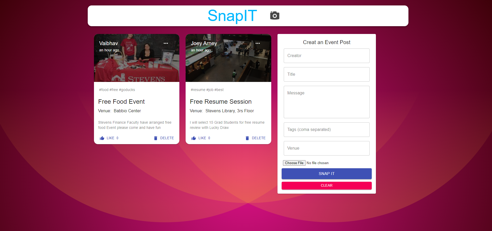

# SnapIt_MERN_App
SnapIT is a socail media app that helps user to post their Back Packing Solo trip Memories

## Project Idea

* I built this project using MERN stack, Heroku for backend CI/CD pipeline, Netlify for front-end hosting
* Main idea was to learn MERN stack by building a real time project
* (Trying to build a Authentication System, so that I also get to learn the Authentication Concept used in Full stack web application)
